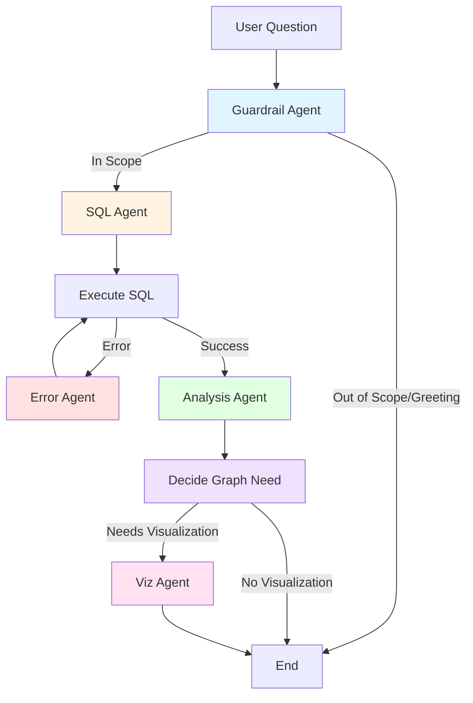
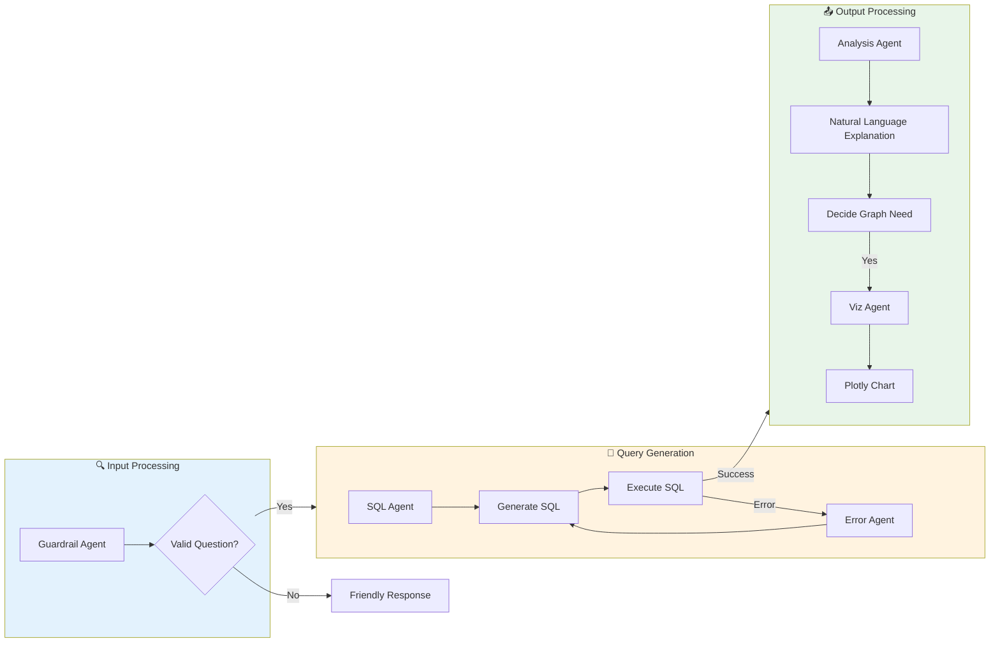
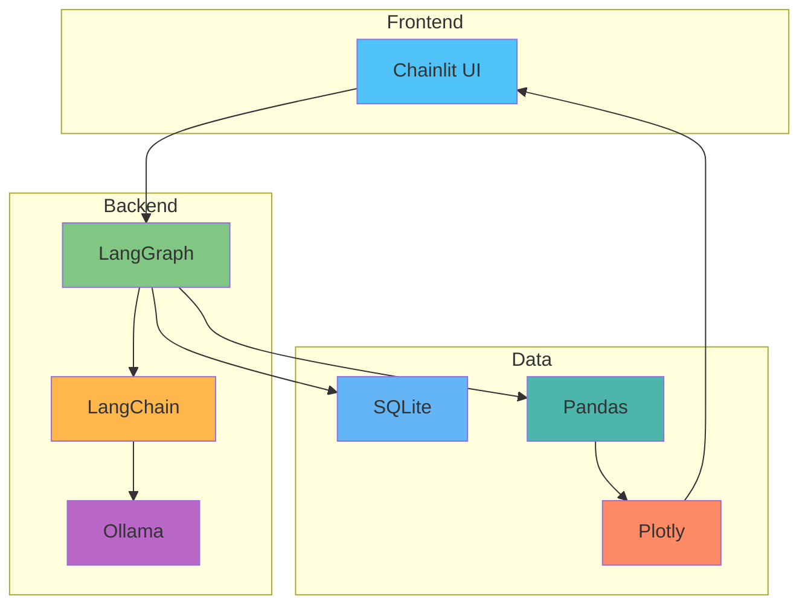

# Multi-Agent E-commerce Text2SQL Chatbot 🤖

A sophisticated **Text-to-SQL AI Agent** that enables natural language querying of e-commerce data with intelligent visualization capabilities. Built with **LangGraph**, **Ollama**, and **Chainlit**.

## 📖 Table of Contents

- [Overview](#overview)
- [Features](#features)
- [Architecture](#architecture)
- [Prerequisites](#prerequisites)
- [Installation](#installation)
- [Ollama Configuration](#ollama-configuration)
- [Database Setup](#database-setup)
- [Running the Application](#running-the-application)
- [Usage Examples](#usage-examples)
- [Project Structure](#project-structure)
- [How It Works](#how-it-works)
- [Troubleshooting](#troubleshooting)
- [Contributing](#contributing)

---

## 🎯 Overview

This AI-powered chatbot allows users to query an e-commerce database using natural language. The system automatically:
1. Validates the question is in scope
2. Generates SQL queries from natural language
3. Executes queries and handles errors automatically
4. Analyzes results and provides natural language explanations
5. Creates interactive visualizations when beneficial

**Key Highlight:** Uses **Ollama** for local LLM inference with the `qwen2.5-coder:7b` model, optimized for SQL and code generation tasks.

---

## ✨ Features

- 🤖 **Multi-Agent Architecture** - Specialized agents for different tasks (guardrails, SQL generation, error correction, analysis, visualization)
- 🛡️ **Intelligent Guardrails** - Validates questions are about e-commerce data, handles greetings gracefully
- 🔄 **Auto Error Correction** - Automatically fixes SQL errors with up to 3 retry attempts
- 📊 **Smart Visualizations** - Generates interactive Plotly charts (bar, line, pie, scatter) when data benefits from visualization
- 💬 **Natural Language I/O** - Ask questions in plain English, get human-readable answers
- 🎨 **Interactive UI** - Clean Chainlit interface with real-time workflow tracking
- 🔒 **Local LLM** - Uses Ollama for privacy-focused, local inference (no API costs!)

---

## 🏗️ Architecture

### Multi-Agent Workflow



### Agent Responsibilities



### State Flow

The agent system maintains state throughout the conversation:

| State Field | Type | Description |
|-------------|------|-------------|
| `question` | string | User's natural language question |
| `sql_query` | string | Generated SQL query |
| `query_result` | string | Database query results |
| `error` | string | Error message if query fails |
| `iteration` | int | Retry attempt counter (max 3) |
| `needs_graph` | bool | Whether visualization is beneficial |
| `graph_type` | string | Type of chart (bar/line/pie/scatter) |
| `graph_json` | string | Plotly figure JSON |
| `final_answer` | string | Natural language response |
| `is_in_scope` | bool | Whether question is valid |

---

## 📋 Prerequisites

Before you begin, ensure you have the following installed:

- **Python 3.11** (recommended for best compatibility)
  - *Note: Python 3.13+ may have compatibility issues with Chainlit/AnyIO on Windows*
- **Ollama** - Local LLM runtime ([Installation Guide](#ollama-configuration))
- **Git** (optional, for cloning the repository)

---

## 🛠️ Installation

### Step 1: Clone or Download the Project

```bash
git clone <your-repository-url>
cd ia-agent
```

Or download and extract the ZIP file.

### Step 2: Create a Virtual Environment

**Option A: Using Anaconda (Recommended)**
```bash
conda create -n text2sql_env python=3.11
conda activate text2sql_env
```

**Option B: Using venv**
```bash
# Windows
python -m venv .venv
.venv\Scripts\activate

# macOS/Linux
python3 -m venv .venv
source .venv/bin/activate
```

### Step 3: Install Python Dependencies

```bash
pip install -r requirements.txt
```

This will install:
- `langgraph` - Multi-agent orchestration framework
- `langchain` & `langchain-community` - LLM integration tools
- `langchain-ollama` - Ollama integration for LangChain
- `chainlit` - Chat UI framework
- `pandas` - Data manipulation
- `plotly` - Interactive visualizations
- `python-dotenv` - Environment variable management
- `sqlalchemy` - Database toolkit
- And other supporting libraries

### Step 4: Configure Environment Variables

Copy the example environment file:

```bash
# Windows
copy .env.example .env

# macOS/Linux
cp .env.example .env
```

Edit `.env` and add your API keys (if using cloud models):

```env
# Optional - only needed if using Gemini models instead of Ollama
GOOGLE_API_KEY=your_google_api_key_here

# Optional - only needed if using HuggingFace models
HUGGINGFACEHUB_API_TOKEN=your_huggingface_token_here
```

> **Note:** If you're using Ollama (default configuration), you don't need to add any API keys!

---

## 🦙 Ollama Configuration

This project uses **Ollama** for local LLM inference, which means:
- ✅ No API costs
- ✅ Privacy-focused (data stays local)
- ✅ Fast inference on your machine
- ✅ Works offline

### What is Ollama?

Ollama is a lightweight, extensible framework for running large language models locally. It provides a simple API for running models like Llama, Mistral, and Qwen on your own hardware.

### Installing Ollama

#### Windows
1. Download the installer from [ollama.com/download](https://ollama.com/download)
2. Run the installer and follow the prompts
3. Ollama will start automatically as a service

#### macOS
```bash
# Using Homebrew
brew install ollama

# Or download from ollama.com/download
```

#### Linux
```bash
curl -fsSL https://ollama.com/install.sh | sh
```

### Pulling the Model

This project uses **qwen2.5-coder:7b**, a model optimized for code generation and SQL tasks.

```bash
ollama pull qwen2.5-coder:7b
```

**Model Details:**
- **Size:** ~4.7 GB
- **Parameters:** 7 billion
- **Optimized for:** Code generation, SQL, structured output
- **Context window:** 32K tokens
- **Quantization:** Q4_0 (good balance of speed and quality)

### Verifying Ollama Installation

Test that Ollama is running:

```bash
ollama list
```

You should see `qwen2.5-coder:7b` in the list.

Test the model:

```bash
ollama run qwen2.5-coder:7b "Write a SQL query to select all users"
```

### Alternative Models

You can use different models by editing `text2sql_agent.py`:

```python
# Line 26 in text2sql_agent.py
OLLAMA_MODEL = "qwen2.5-coder:7b"  # Change this to your preferred model
```

**Recommended alternatives:**
- `codellama:7b` - Meta's code-focused model
- `mistral:7b` - General-purpose, fast model
- `llama3.1:8b` - Latest Llama model with strong reasoning
- `deepseek-coder:6.7b` - Specialized for code tasks

**Note:** Larger models (13B, 70B) will provide better results but require more RAM and are slower.

---

## 🗄️ Database Setup

The project uses a SQLite database with Brazilian e-commerce data.

### Option 1: Use Existing Database

If `ecommerce.db` already exists in the project directory, you can skip this step.

### Option 2: Initialize from CSV Files

If you have the CSV files in the `data/` folder:

```bash
python db_init.py
```

This will:
1. Create a new `ecommerce.db` file
2. Load all CSV files from the `data/` folder
3. Create 9 tables with proper schema

**Expected output:**
```
Loading olist_customers_dataset.csv into table customers...
Table customers created with 99441 rows.
Loading olist_orders_dataset.csv into table orders...
Table orders created with 99441 rows.
...
Database initialization complete.
```

### Database Schema

The database contains 9 tables:

| Table | Description | Rows |
|-------|-------------|------|
| `customers` | Customer information (ID, location) | ~99K |
| `orders` | Order details (status, timestamps) | ~99K |
| `order_items` | Individual items in orders | ~112K |
| `order_payments` | Payment information | ~103K |
| `order_reviews` | Customer reviews and ratings | ~99K |
| `products` | Product catalog (dimensions, category) | ~32K |
| `sellers` | Seller information and location | ~3K |
| `geolocation` | Geographic coordinates | ~1M |
| `product_category_name_translation` | Category translations (PT → EN) | 71 |

**Relationships:**
```
customers → orders → order_items → products
                  ↓
            order_payments
                  ↓
            order_reviews
```

---

## 🚀 Running the Application

### Start the Chatbot

Ensure Ollama is running, then:

```bash
chainlit run app.py
```

The application will start on `http://localhost:8000`

**Alternative port:**
```bash
chainlit run app.py --port 8090
```

### What to Expect

1. Browser opens automatically to `http://localhost:8000`
2. Welcome message appears with quick start guide
3. Type your question in the chat input
4. Agent workflow executes (you'll see the SQL query generated)
5. Results appear with natural language explanation
6. Interactive chart displays (if applicable)

---

## 💡 Usage Examples

### Simple Queries

**Question:** "How many orders were delivered in 2017?"

**Response:**
- **Generated SQL:** `SELECT COUNT(*) FROM orders WHERE strftime('%Y', order_delivered_customer_date) = '2017'`
- **Answer:** "There were 45,101 orders delivered in 2017."

---

**Question:** "What's the total revenue for 2018?"

**Response:**
- **Generated SQL:** `SELECT SUM(payment_value) FROM order_payments JOIN orders ON order_payments.order_id = orders.order_id WHERE strftime('%Y', order_purchase_timestamp) = '2018'`
- **Answer:** "The total revenue for 2018 was $8,451,584.32."

---

### Queries with Visualizations

**Question:** "Show me the top 10 customers by spending"

**Response:**
- **Generated SQL:** `SELECT customer_id, SUM(payment_value) as total_spent FROM order_payments JOIN orders ON order_payments.order_id = orders.order_id GROUP BY customer_id ORDER BY total_spent DESC LIMIT 10`
- **Answer:** "Here are the top 10 customers by total spending..."
- **Visualization:** Interactive bar chart showing customer IDs and spending amounts

---

**Question:** "What's the yearly revenue trend?"

**Response:**
- **Generated SQL:** `SELECT strftime('%Y', order_purchase_timestamp) as year, SUM(payment_value) as revenue FROM order_payments JOIN orders ON order_payments.order_id = orders.order_id GROUP BY year ORDER BY year`
- **Answer:** "Revenue grew from $1.2M in 2016 to $8.4M in 2018..."
- **Visualization:** Line chart showing revenue growth over time

---

### Complex Multi-Part Queries

**Question:** "How much revenue was generated in 2018? And how many orders were placed in 2017?"

**Response:**
The agent handles this as a compound question, generating appropriate SQL for each part and providing a comprehensive answer.

---

### Out-of-Scope Questions

**Question:** "What's the weather today?"

**Response:** "I can only answer questions about the e-commerce database. Please ask about orders, sales, or products."

---

**Question:** "Hi!"

**Response:** "Hello! I can help you analyze your e-commerce data. Ask me about orders, products, or customers."

---

## 📁 Project Structure

```
ia-agent/
├── app.py                      # Chainlit UI application (main entry point)
├── text2sql_agent.py           # Multi-agent workflow with LangGraph
├── db_init.py                  # Database initialization script
├── requirements.txt            # Python dependencies
├── .env                        # Environment variables (API keys)
├── .env.example                # Environment template
├── chainlit.md                 # Welcome screen content
├── ecommerce.db                # SQLite database (generated)
├── data/                       # CSV source files
│   ├── olist_customers_dataset.csv
│   ├── olist_orders_dataset.csv
│   ├── olist_order_items_dataset.csv
│   ├── olist_order_payments_dataset.csv
│   ├── olist_order_reviews_dataset.csv
│   ├── olist_products_dataset.csv
│   ├── olist_sellers_dataset.csv
│   ├── olist_geolocation_dataset.csv
│   └── product_category_name_translation.csv
├── .chainlit/                  # Chainlit configuration (auto-generated)
└── .venv/                      # Virtual environment (created by you)
```

### Core Files

| File | Purpose |
|------|---------|
| `app.py` | Chainlit UI integration, handles user messages and displays responses |
| `text2sql_agent.py` | Multi-agent system with LangGraph, contains all agent logic |
| `db_init.py` | Database initialization from CSV files |
| `requirements.txt` | Python package dependencies |
| `.env` | Environment variables (API keys) - **DO NOT COMMIT** |
| `.env.example` | Template for environment configuration |

---

## 🔍 How It Works

### Agent Workflow (Step-by-Step)

1. **User Input**
   - User types a question in the Chainlit interface
   - Question is passed to the agent graph

2. **Guardrail Agent**
   - Validates if the question is about e-commerce data
   - Detects greetings and out-of-scope questions
   - Returns early with friendly message if not in scope

3. **SQL Agent**
   - Receives the validated question
   - Analyzes database schema
   - Generates SQL query using Ollama LLM
   - Cleans up any markdown formatting

4. **Execute SQL**
   - Runs the generated query against SQLite database
   - Captures results or error messages

5. **Error Agent (if needed)**
   - Triggered if SQL execution fails
   - Analyzes the error message
   - Generates corrected SQL query
   - Retries up to 3 times

6. **Analysis Agent**
   - Receives successful query results
   - Generates natural language explanation
   - Provides context and insights

7. **Decide Graph Need**
   - Analyzes if visualization would be helpful
   - Determines appropriate chart type (bar/line/pie/scatter)
   - Based on data structure and question type

8. **Viz Agent (if needed)**
   - Generates Python code using Plotly Express
   - Executes code to create interactive chart
   - Returns chart as JSON for display

9. **Response to User**
   - SQL query displayed (for transparency)
   - Natural language answer
   - Interactive visualization (if generated)

### Technology Stack



---

## 🐛 Troubleshooting

### Ollama Issues

**Problem:** `Connection refused` or `Ollama not found`

**Solution:**
1. Verify Ollama is running: `ollama list`
2. Start Ollama service:
   - **Windows:** Ollama runs as a service automatically
   - **macOS/Linux:** `ollama serve`
3. Check Ollama is listening on `http://localhost:11434`

---

**Problem:** Model not found

**Solution:**
```bash
ollama pull qwen2.5-coder:7b
```

---

### Python Environment Issues

**Problem:** `ImportError` or `ModuleNotFoundError`

**Solution:**
1. Ensure virtual environment is activated
2. Reinstall dependencies:
   ```bash
   pip install -r requirements.txt
   ```

---

**Problem:** `anyio.NoEventLoopError` on Windows

**Solution:**
- The code includes automatic fixes for Windows event loop issues
- If problems persist, use Python 3.11 instead of 3.13+
- Ensure `nest_asyncio` is installed

---

### Database Issues

**Problem:** `no such table` errors

**Solution:**
1. Verify `ecommerce.db` exists in project root
2. Reinitialize database:
   ```bash
   python db_init.py
   ```
3. Ensure CSV files are in `data/` folder

---

**Problem:** Database locked

**Solution:**
- Close any other programs accessing `ecommerce.db`
- Restart the application

---

### Chainlit Issues

**Problem:** Port already in use

**Solution:**
```bash
chainlit run app.py --port 8090
```

---

**Problem:** Browser doesn't open automatically

**Solution:**
Manually navigate to `http://localhost:8000`

---

### Query Issues

**Problem:** SQL errors persist after 3 retries

**Solution:**
- The question might be too complex or ambiguous
- Try rephrasing the question more specifically
- Check if the data you're asking about exists in the database

---

**Problem:** Visualizations not appearing

**Solution:**
- Check browser console for JavaScript errors
- Ensure Plotly is installed: `pip install plotly`
- Try asking a different question that clearly needs a chart

---

## 🤝 Contributing

Contributions are welcome! Here are some ideas:

- **Add new agent types** (e.g., data validation, query optimization)
- **Support additional databases** (PostgreSQL, MySQL)
- **Improve visualization logic** (more chart types, better auto-detection)
- **Add conversation memory** (remember context from previous questions)
- **Implement query caching** (faster responses for repeated questions)
- **Add authentication** (user login, role-based access)

---

## 📄 License

This project is provided as-is for educational and commercial use.

---

## 🙏 Acknowledgments

Built with these amazing open-source tools:

- **[LangGraph](https://github.com/langchain-ai/langgraph)** - Multi-agent orchestration framework
- **[LangChain](https://github.com/langchain-ai/langchain)** - LLM application framework
- **[Ollama](https://ollama.com/)** - Local LLM runtime
- **[Chainlit](https://chainlit.io/)** - Chat UI framework
- **[Plotly](https://plotly.com/)** - Interactive visualizations
- **[SQLite](https://www.sqlite.org/)** - Embedded database

**Dataset:** Brazilian E-Commerce Public Dataset by Olist (Kaggle)

---

## 📞 Support

If you encounter issues:

1. Check the [Troubleshooting](#troubleshooting) section
2. Review [Ollama documentation](https://ollama.com/docs)
3. Check [Chainlit documentation](https://docs.chainlit.io)
4. Open an issue on GitHub (if applicable)

---

**Happy querying! 🚀**
